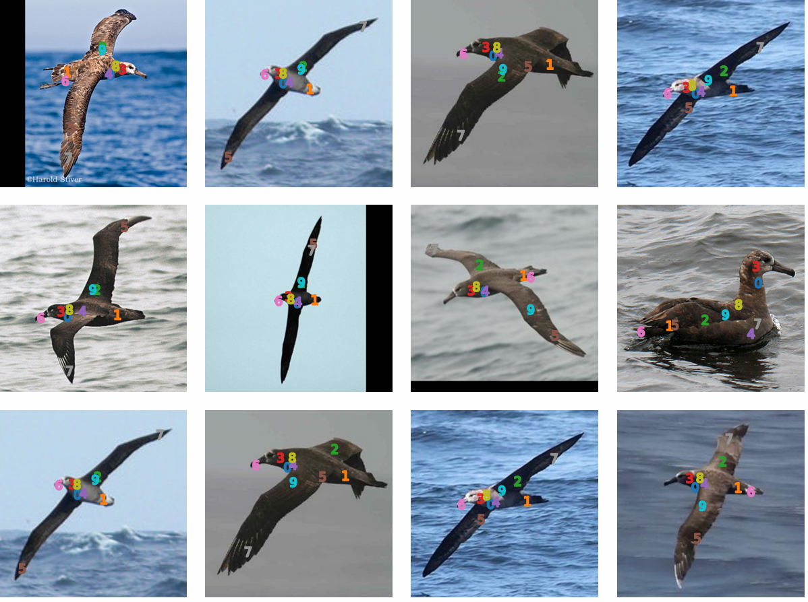
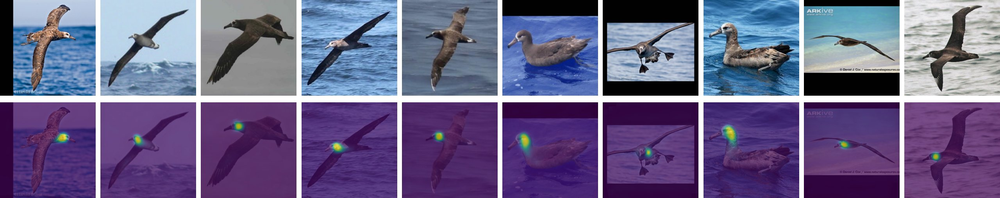
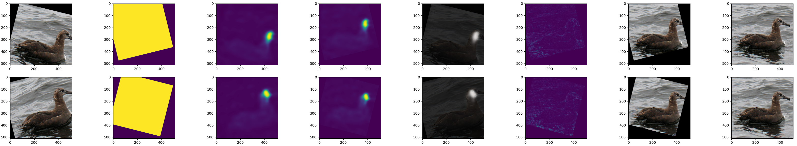

# StableImageKeypoints

**[中文版本](README.md) | English**

> This is an improved version of the original StableKeypoints project. For details about the original project, please visit the [original repository](https://github.com/ubc-vision/StableKeypoints).

## Improvements

I have made the following key improvements to the original code:

1. **Configuration File Refactoring**: Changed command-line arguments to a YAML-based configuration file system
2. **Diffusers Version Upgrade**: Upgraded from version 0.8 to 0.33, adapting to the latest API changes
3. **Multi-GPU Training Optimization**: Fixed device synchronization issues during multi-GPU training
4. **Modernization Compatibility**: Updated code to be compatible with the latest libraries and language requirements
5. **Code Cleanup and Optimization**: Cleaned and refactored the code structure

## Quick Start

### Environment Setup

Make sure you have installed the necessary dependencies (including PyTorch, diffusers, transformers, etc.).

### Weights & Biases Login

First, log in to wandb for training monitoring:

```bash
wandb login
```

### Dataset Preparation

Using the CUB dataset as an example:

1. Download the CUB-200-2011 dataset from the [Caltech official website](https://data.caltech.edu/records/65de6-vp158)
2. Extract the downloaded dataset to the `data/` directory
3. Extract `datasets/cub_cachedir.zip` from the project to the `data/CUB_200_2011/` directory

The final directory structure should look like this:

```
data/
└── CUB_200_2011/
    ├── attributes/
    ├── cachedir/
    │   └── cub # from extracted cub_cachedir.zip
    ├── images/
    │   ├── 001.Black_footed_Albatross/
    │   └── ...
    ├── parts/
    └── ...
```

> To use other datasets (CelebA, Taichi, Human3.6M, DeepFashion, etc.), please refer to the dataset download guide in the original repository.

### Configuration File

Edit the `configs/default.yaml` file to suit your needs:

```yaml
# More configuration options...

# Dataset configuration
dataset:
  name: "cub_001" # or other dataset names
  location: "data" # dataset path

# Model configuration
model:
  type: "sd-legacy/stable-diffusion-v1-5" # or "stabilityai/stable-diffusion-2-1-base"
  my_token: null # If needed, enter your Hugging Face token

# Training configuration
training:
  num_steps: 100 # Adjust as needed
  batch_size: 8
  device: "cuda"
```

### Start Training

After configuration, run the following command to start training:

```bash
python3 -m src.main
```

After training is complete, you will find checkpoints in the `outputs/` directory (or the directory specified in the configuration), including visualization images.

## Model Recommendations

For better results, it is recommended to use the `stabilityai/stable-diffusion-2-1-base` model. This is the last Stable Diffusion model that uses the UNet architecture with the same Attention modules.

**Note**: This project does not support Stable Diffusion 3 and above, as they no longer use the UNet architecture.

## Results







This project is not a difficult task; it is mainly an improvement of existing code. I hope this improved version will help with your research.
