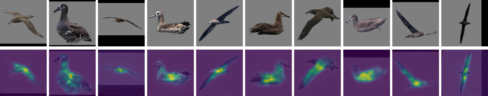

# Stable123Keypoints Stage1

English | [简体中文](README.md)

Keypoint Extraction Exploration Project Based on Zero123Plus Model - Stage 1 Research Report.

## Project Overview

Stable123Keypoints aims to explore the application potential of the `sudo-ai/zero123plus-v1.2` model in keypoint detection tasks. This stage focuses on evaluating the direct usability of Zero123Plus pre-trained weights under the same architecture as [StableImageKeypoints v1.5](https://github.com/Aloento/StableImageKeypoints/blob/v1.5/README_EN.md).

## Experimental Design

### Testing Protocol

- **Baseline Model**: `sd-legacy/stable-diffusion-v1-5`
- **Test Model**: `sudo-ai/zero123plus-v1.2`
- **Network Architecture**: Kept basically consistent with `StableImageKeypoints v1.5`
- **Comparison Dimensions**:
  - Loss function convergence
  - Attention mechanism activation patterns
  - Keypoint extraction effectiveness

## Quick Start

Please refer to the environment configuration requirements of [StableImageKeypoints v1.5](https://github.com/Aloento/StableImageKeypoints/blob/v1.5/README_EN.md#quick-start).

1. **Clone the Project**

   ```bash
   git clone https://github.com/SoarCraft/Stable123Keypoints.git
   cd Stable123Keypoints
   ```

2. **Install Dependencies**

   Follow the dependency installation process of `StableImageKeypoints v1.5`.

3. **Preprocess Data**

   Run the following command to generate image matting results for `Zero123Plus`:

   ```bash
   python -m datasets.cub_preprocess
   ```

4. **Training/Inference**

   The remaining operation steps are consistent with the `StableImageKeypoints` project.

## Experimental Results

### Training Convergence Analysis


As shown in the figure, when training with `Zero123Plus` model weights, the loss function converges normally, initially indicating that the model has learning capability.

### Attention Mechanism Analysis



However, through visualization analysis of the attention maps after the model is activated by `context`, we discovered a **critical issue**: the attention distribution exhibits a **divergent state**, failing to form the expected concentrated response pattern at keypoint locations.

### Comparative Experiment Verification

To rule out the influence of loading methods, we conducted the following comparative tests:

1. **Full Zero123Plus Pipeline Loading**: Attention divergence ❌
2. **Zero123Plus Weights Only (without Pipeline)**: Attention divergence ❌
3. **Using stable-diffusion-v1-5 Weights (same architecture and configuration)**: Keypoint extraction normal ✅

## Stage Conclusions

### Core Findings

**Without targeted code modifications, the Zero123Plus pre-trained weights cannot be directly applied to keypoint extraction tasks.**

Although the loss function converges normally during model training, the model does not produce the expected response to pure context. Specifically:

- ✅ **Training Feasibility**: Loss function convergence is normal
- ❌ **Functional Effectiveness**: Attention mechanism not activated at keypoint locations
- ✅ **Code Correctness**: `SD-1.5` weights work normally with the same code

### Problem Attribution Analysis

Considering the minimal structural differences between `Zero123Plus` and `Stable Diffusion v1.5`, we infer:

**The special operations introduced during Zero123Plus pre-training (such as multi-view condition injection, reference image attention, etc.) have fundamentally changed how the model's internal weights process `encoder_hidden_states`.**

This change is not a simple feature extraction difference, but involves deep reconstruction of the attention mechanism, making it difficult for the model to produce spatially localized responses to pure text `context` like the original SD model.

> [!CAUTION]  
> **Do not use FP16 precision**  
> Using half-precision floating-point numbers will cause significant precision loss, which will prevent the model from converging.
